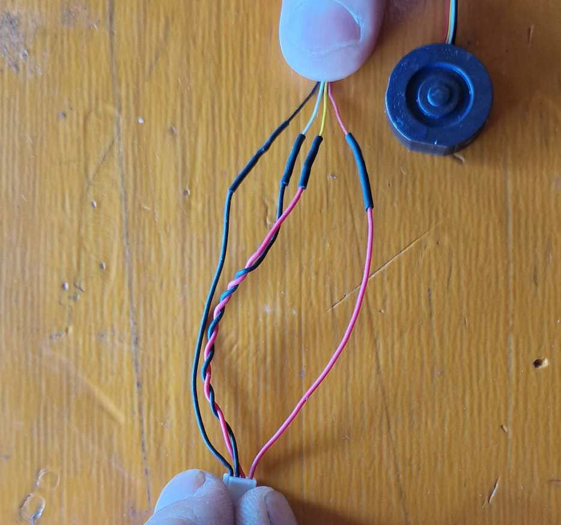

==================================
HowTo: configure the Weight module
==================================

Configuration of the Soleon weight module is a bit tricky. This describes how the setup needs to be done

How to start
------------

Build connector sensor to Cube Orange

Step by step instruction
------------------------

blablabla

.. hint::

   This is under development.

   

